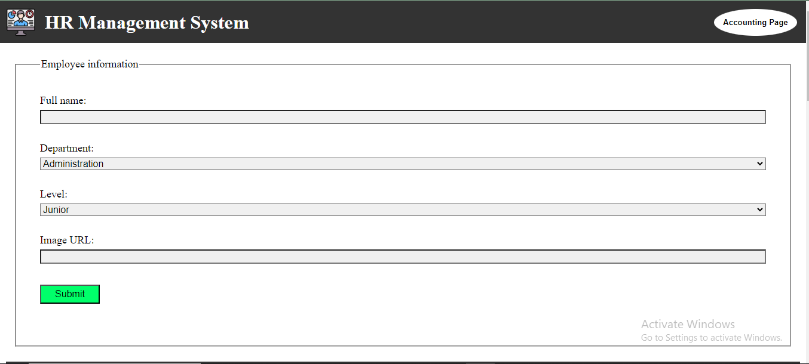
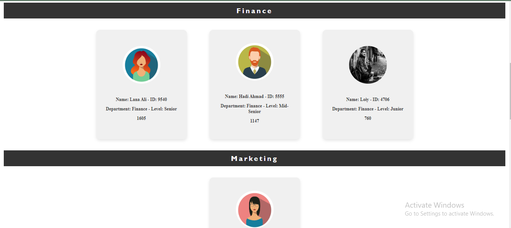
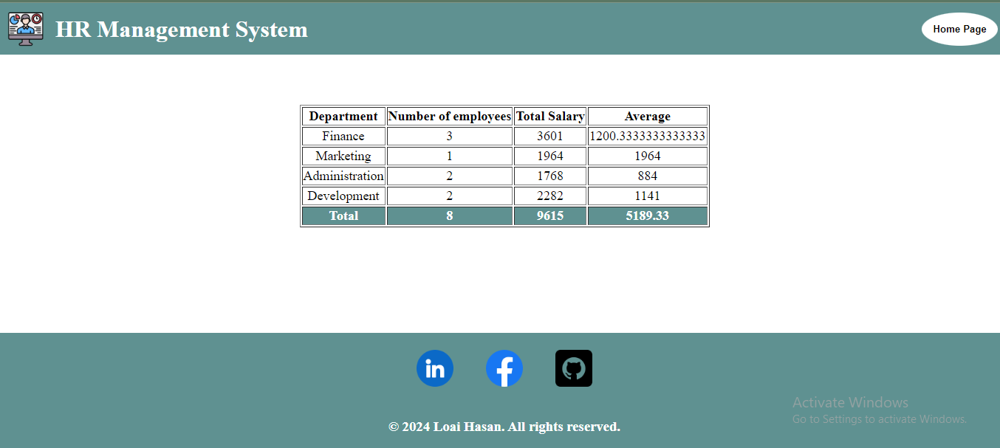

# HR-management-system

# Home page.

* You can adding a new employee data.
* The data will be saved in local storage.
* You can move to the accounting page.

 
 

# Accounting page.

* The employees data will be shown in a table.
* The table contains employees statistics.

